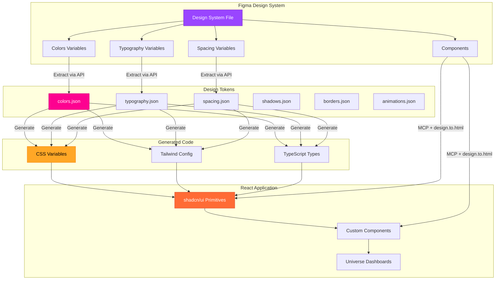
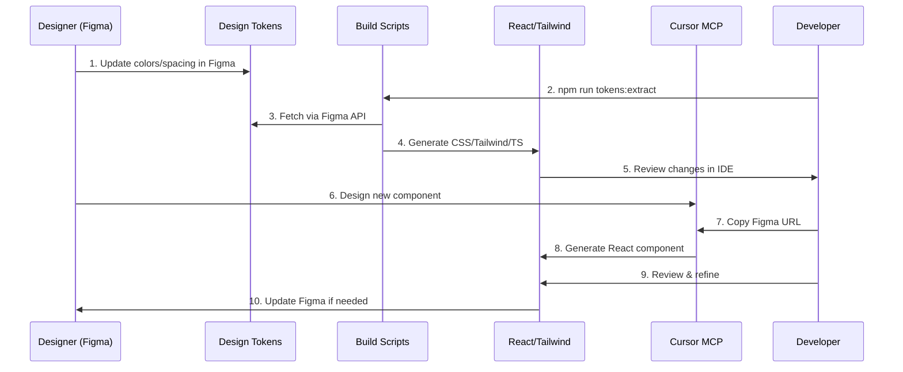
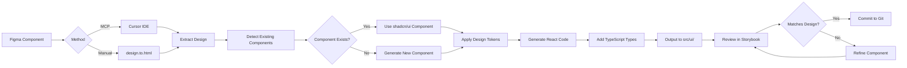
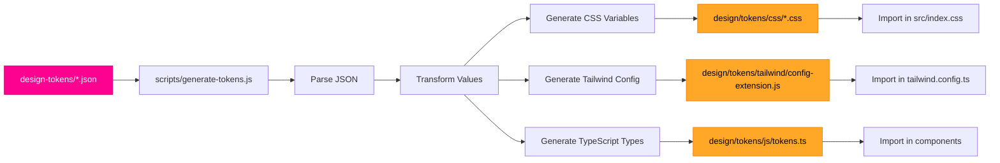

# Design System Architecture



## Workflow Diagram



## Component Generation Flow



## Universe Color System

```mermaid
graph TB
    subgraph "Base Colors"
        A[Primary Purple<br/>hsl(280, 85%, 50%)]
        B[Secondary Golden<br/>hsl(45, 100%, 55%)]
        C[Brand Pink<br/>#FD0290]
    end

    subgraph "Universe Accents"
        D[Talent<br/>Pink]
        E[DJ<br/>Golden]
        F[Producer<br/>Warm Orange]
        G[Fan<br/>Secondary]
    end

    subgraph "Gradients"
        H[Primary<br/>Purple → Pink]
        I[Secondary<br/>Golden → Orange]
        J[Hero<br/>Purple → Pink → Golden]
    end

    subgraph "Glow Effects"
        K[Primary Glow<br/>Purple shadow]
        L[Secondary Glow<br/>Golden shadow]
        M[Golden Glow<br/>Golden shadow]
    end

    A --> D
    C --> D

    B --> E
    B --> G

    A --> H
    C --> H

    B --> I

    A --> J
    C --> J
    B --> J

    A --> K
    B --> L
    B --> M

    style A fill:#9945FF,stroke:#7B2CBF,color:#fff
    style B fill:#FFA726,stroke:#F57C00,color:#000
    style C fill:#FD0290,stroke:#C10172,color:#fff
    style D fill:#FD0290,stroke:#C10172,color:#fff
    style E fill:#FFA726,stroke:#F57C00,color:#000
    style F fill:#FF6B35,stroke:#D64933,color:#fff
```

## Token Generation Pipeline



## File Structure

```
design/
├── README.md                    📖 Main documentation
├── GETTING_STARTED.md           🚀 Setup guide
├── IMPLEMENTATION_SUMMARY.md    📋 What was created
├── design-tokens/               🎨 Source of truth
│   ├── colors.json             (Colors: brand, semantic)
│   ├── typography.json         (Fonts: families, sizes, weights)
│   ├── spacing.json            (Spacing: 0-40 scale)
│   ├── shadows.json            (Shadows: elevation + glow)
│   ├── borders.json            (Borders: radius scale)
│   └── animations.json         (Animations: keyframes + easing)
├── figma/                       🔗 Figma integration
│   ├── plugin-config.json      (Plugin settings)
│   ├── component-mapping.json  (Figma ↔ React mapping)
│   └── sync-strategy.md        (Sync workflow)
├── tokens/                      ⚙️ Generated (auto)
│   ├── css/                    (CSS custom properties)
│   ├── tailwind/               (Tailwind config extension)
│   └── js/                     (TypeScript types)
└── documentation/               📚 Guidelines
    └── color-usage.md          (Color guidelines)
```

## Key Benefits

1. **Single Source of Truth**: Figma → Tokens → Code (no manual sync)
2. **Universe-Aware**: Automatic adaptation to active universe context
3. **Automated Workflows**: `npm run design:sync` updates everything
4. **Component Mapping**: Figma components → React components (1:1)
5. **MCP Integration**: Generate code directly from Figma in Cursor
6. **Dark Mode Native**: Light/dark modes defined in design tokens
7. **Accessibility**: WCAG 2.1 AA compliance built-in
8. **Type Safety**: TypeScript types generated from design tokens

## Quick Start Commands

```bash
# Extract design tokens from Figma
npm run tokens:extract

# Generate CSS, Tailwind config, TypeScript types
npm run tokens:generate

# Full sync (extract + generate + format)
npm run design:sync

# Validate design system consistency
npm run design:validate
```

