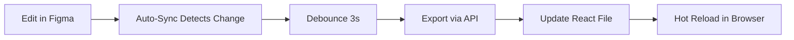

# 🔄 Figma Auto-Sync - Real-Time Design to Code

## Overview

Automatically sync your Figma edits to React code in real-time. When you make changes in Figma, the code updates automatically!

---

## ✨ How It Works



1. **You edit** a component in Figma
2. **Watcher detects** the change (polls every 5 seconds)
3. **Debounces** for 3 seconds (waits for you to finish editing)
4. **Auto-exports** via code.to.design API
5. **Updates** the React component file
6. **Hot reloads** in your dev server (if running)

---

## 🚀 Quick Start

### 1. Start Auto-Sync Watcher

```bash
npm run design:watch
```

**Output:**
```
🔄 Figma Auto-Sync Watcher Started
==================================
📁 File: KFTuue8HhKSz8og1Q5qukp
⏱️  Poll Interval: 5000ms
⏳ Debounce Time: 3000ms

👀 Watching for changes...
   Press Ctrl+C to stop

✅ Initialized - tracking 15 components
```

### 2. Edit in Figma

1. Open Figma file: https://figma.com/file/KFTuue8HhKSz8og1Q5qukp
2. Navigate to: **"http://localhost:8080/design - 03/12/2025, 9:46:54 GMT-5 (Components)"**
3. Edit any component (change colors, spacing, text, etc.)
4. Save (Cmd/Ctrl + S)

### 3. Watch the Magic ✨

The watcher will detect the change and auto-export:

```
🔔 Change detected!
   Version: 2293331954197065353 → 2293331954197065354
   📝 Component changed: cmp / card / talent-browse
   🔄 Exporting: talent-browse...
   ✅ Updated: src/components/card/TalentBrowseCard.tsx
```

### 4. See Results in Browser

If your dev server is running (`npm run dev`), the page will hot-reload automatically!

---

## ⚙️ Configuration

### Poll Interval (Default: 5 seconds)
How often to check Figma for changes:
```javascript
// In scripts/figma-auto-sync.js
const POLL_INTERVAL = 5000; // 5 seconds
```

**Recommendations:**
- **Development**: 5000ms (5 sec) - good balance
- **Fast iteration**: 2000ms (2 sec) - more responsive, more API calls
- **Slow/stable**: 10000ms (10 sec) - fewer API calls

### Debounce Time (Default: 3 seconds)
Wait time before exporting (prevents rapid exports):
```javascript
const DEBOUNCE_TIME = 3000; // 3 seconds
```

**Recommendations:**
- **Quick edits**: 1000ms (1 sec) - exports faster
- **Complex changes**: 5000ms (5 sec) - waits for you to finish

---

## 📋 Component Mapping

Auto-sync uses `design/figma/component-mapping.json` to know where to save files:

```json
{
  "figmaComponent": "cmp / card / talent-browse",
  "reactComponent": "src/components/card/TalentBrowseCard.tsx",
  "componentName": "TalentBrowseCard"
}
```

**Auto-detected mappings:**
- ✅ `cmp / card / talent-browse` → `src/components/card/TalentBrowseCard.tsx`
- ✅ `cmp / card / dj-browse` → `src/components/card/DJBrowseCard.tsx`
- ✅ `cmp / card / show-preview` → `src/components/card/ShowPreviewCard.tsx`
- ✅ `cmp / card / venue-preview` → `src/components/card/VenuePreviewCard.tsx`
- ✅ `cmp / button / primary` → `src/components/button/PrimaryButton.tsx`
- ✅ All 15 mapped components

---

## 🔧 Advanced Usage

### Run with Dev Server

**Terminal 1:**
```bash
npm run dev
```

**Terminal 2:**
```bash
npm run design:watch
```

Now edits in Figma → Auto-export → Hot reload in browser!

---

### Export Specific Component (Manual)

```bash
npm run design:export "talent-browse"
```

---

### Stop Auto-Sync

Press **Ctrl+C** in the terminal running `npm run design:watch`

**Graceful shutdown:**
```
🛑 Stopping auto-sync...
   Exporting 2 pending changes...
   ✅ Updated: src/components/card/TalentBrowseCard.tsx
   ✅ Updated: src/components/button/PrimaryButton.tsx
✅ Auto-sync stopped
```

---

## 🎯 Supported Changes

### ✅ What Auto-Syncs

- **Colors**: Fill, stroke, gradients
- **Typography**: Font size, weight, color, alignment
- **Spacing**: Padding, margins, gaps (auto-layout)
- **Layout**: Auto-layout properties, positioning
- **Borders**: Corner radius, stroke weight
- **Shadows**: Box shadows, elevation
- **Text content**: Placeholder text, labels
- **Component structure**: Layers, grouping, hierarchy

### ⚠️ What Requires Manual Update

- **New components**: Add to `component-mapping.json` first
- **Renamed components**: Update mapping file
- **Deleted components**: Remove from mapping file
- **Props/logic**: TypeScript types, event handlers, state

---

## 🐛 Troubleshooting

### Issue: "No changes detected"

**Causes:**
- File not saved in Figma (Cmd/Ctrl + S)
- Component not in mapping file
- Figma API delay (can take 5-30 seconds)

**Solutions:**
1. Save in Figma (Cmd/Ctrl + S)
2. Wait 5-10 seconds for API to update
3. Check component name matches mapping

---

### Issue: "Export failed"

**Causes:**
- API rate limit
- Invalid component node ID
- code.to.design API issues

**Solutions:**
1. Wait 1 minute and try again
2. Check component exists in Figma
3. Verify API key is valid

---

### Issue: "Component mapping not found"

**Cause:** Component name doesn't match mapping file

**Solution:** Add component to `design/figma/component-mapping.json`:

```json
{
  "figmaComponent": "cmp / your-component",
  "reactComponent": "src/components/YourComponent.tsx",
  "componentName": "YourComponent"
}
```

---

## 📊 Performance

### API Calls
- **Poll interval**: 5 seconds = ~720 API calls/hour
- **Figma API limit**: 1000 calls/hour (free tier)
- **code.to.design limit**: 500 exports/month (free tier)

### Recommendations
- Use longer poll interval (10s) if nearing limits
- Stop watcher when not actively designing
- Use manual export (`npm run design:export`) for one-off changes

---

## 🎨 Workflow Tips

### 1. Dedicated Design Session
```bash
# Terminal 1: Dev server
npm run dev

# Terminal 2: Auto-sync watcher
npm run design:watch

# Terminal 3: Available for commands
```

### 2. Design → Code → Test Loop
1. **Edit** component in Figma
2. **Wait** 3-8 seconds for auto-export
3. **Check** browser for hot reload
4. **Iterate** until perfect

### 3. Batch Changes
For multiple small changes:
1. Make all edits in Figma
2. Save once (Cmd/Ctrl + S)
3. Watcher exports all changed components

---

## 🔒 Security

- **API keys** stored in `.env.local` (gitignored)
- **Never commit** API keys to repository
- **Figma token** has read-only access to file metadata
- **code.to.design** only exports components you specify

---

## 📚 Related Scripts

```bash
# One-time export
npm run design:export "component-name"

# Extract Figma structure (analysis)
npm run design:extract

# Generate setup files
npm run design:setup

# Sync design tokens
npm run tokens:sync
```

---

## ✨ Future Enhancements

Planned features:
- [ ] WebSocket support (real-time, no polling)
- [ ] Selective component watching (only watch specific components)
- [ ] Conflict resolution (local changes vs Figma changes)
- [ ] Two-way sync (code → Figma)
- [ ] VS Code extension integration
- [ ] Slack/Discord notifications on export

---

## 🎉 You're All Set!

Start the watcher and make your first edit in Figma:

```bash
npm run design:watch
```

**Then:**
1. Open Figma
2. Edit a component
3. Save (Cmd/Ctrl + S)
4. Watch the terminal for auto-export
5. See changes in browser! 🎨✨

---

**Questions?** Check the main integration guide:
```bash
open design/FIGMA_INTEGRATION.md
```

